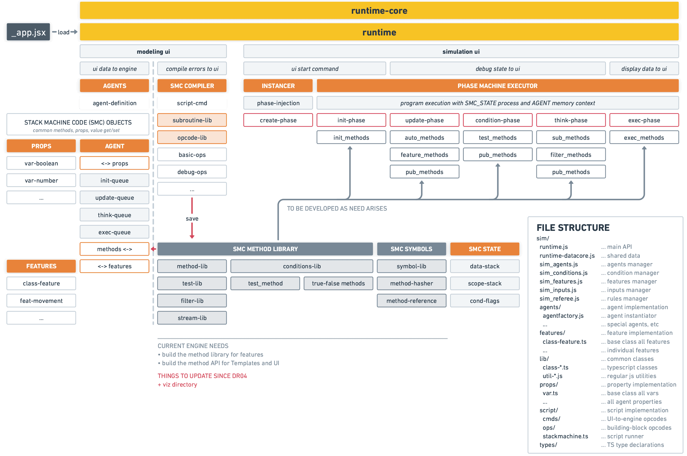
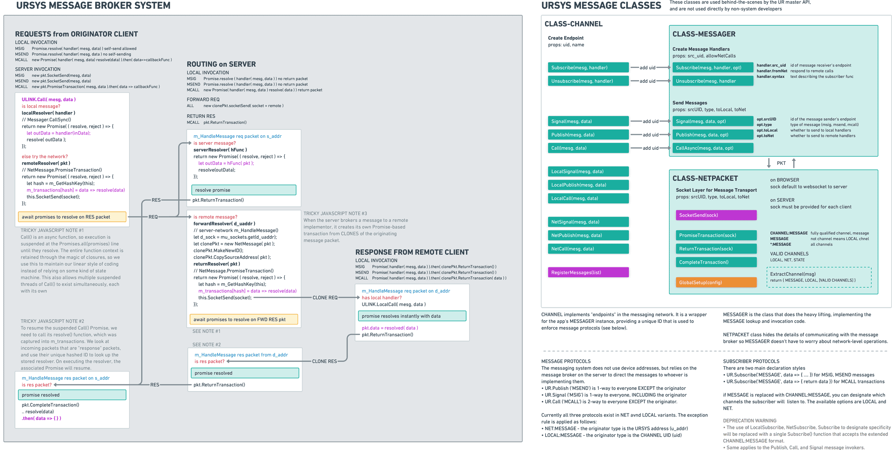
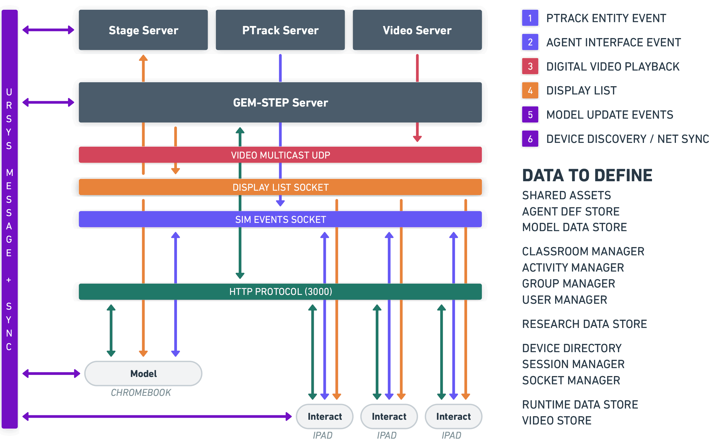

## October 5, 2020 - Review of Work

We're at the point where our major subsystems are coming together. It has taken longer than expected, but we've also made the effort to make our new code more reusable and faster to modify in the future. 

For context, here are the highlights of GEM-STEP development to date:

1. Made a **Development Environment for Managing Multiple Related Codebases**. With the number of independent servers and web application codebases, this was critical to make sure all related code was in one repository. 
2. Extracted **Relevant Code from STEP/PLAE projects** to merge into our current development stack. Most notably this is the **PTrack** module.
3. Built the **Admin Webapp Framework with NextJS**. This wraps our favored web technologies into a clean prototype building framework. To date it has been more useful for wireframing screen flow concepts, but when we start writing the admnin interfaces it will be an improvement over our old system. 
4. Made the **GEMscript Scriptable Simulation Engine** from the researcher specifications, further resolving details until we could implement. It's a stand-alone module that can exist in multiple code environments. 

In August 2020 we had a working Scriptable Simulation engine, but did not have a way to actually see what it was doing or modify scripts outside the development environment. These are necessary for the research team to evaluate the scripting engine in a tangible way. To expedite the process, we started two parallel tracks of development: 

5. **Simulation Visualization** - This is the graphics pipeline that converts agents data into a representation on the screen, which we call the **Renderer**. An additional requirement is to support the distribution of graphics symbols from the computer running the simulation to multiple devices such as iPads. 
6. **Scripting Interface** - This is the critical "GEMscript Wizard" feature prototype that can be used to drive the ScriptSim Engine. It also allows the team to experience the entire workflow of modeling, simulating, and modifying data for the first time. We expect this to have several iterations.  

As of October 5, we have both the Renderer and Prototype Scripting Interface, but they are still **separate codebases** due to the parallel development. One of our next immediate steps will be merging the two code modules together. 

The rest of this document is a review of the supporting work we have done to get to this point. While we have tried to describe each subsystem at a high level, it is a somewhat technical discussion in nature. You can safely skip to the last section **Next Tasks** for a review of our anticipated next steps. Of course, we will do our best to address any feedback or concerns, and will change our development task list as necessary.

## GEM-STEP Development Highlights

The highlights are listed in **reverse chronological order**, so if you just want to see what's new just read the first few sections. The section **GEMscript Engine (Aug 2020)** is most relevant to the research, as it describes the capabilities and limits of the scripting engine. The other sections are more of technical interest for readers who like knowing about how things work. 

Here's an outline of the technology pieces we discuss:

* GEM-STEP Renderer (Sep 2020)
  * Pool class for efficient management of resources
  * MappedPool for efficent transformation of objects into derived objects
  * SyncedMap for managing sets of Pools and MappedPools
  * Agent to DisplayObject to VisualObject Pipeline
* GEMscript Engine (Aug 2020)
  * Observations
  * Implications for Script Engine
  * GEMscript Program Design
  * Handling Conditional Execution
  * Stack Machine Code Model
    * SMC Opoerations
    * SMprogram Generation
    * SMprogram Execution
    * Expanding the Opcode System
    * Overall System Design Diagram
* PhaseMachine Class (June 2020)
* Universal Cross-device Messaging System (May 2020)

### GEM-STEP Renderer (September 2020)

The first version of STEP (2014) was designed to run on a single powerful laptop running a web application. Feature extensions through subsequent STEP, PLAE, and iSTEP grants required an extension of the original system so we could handle multiple devices. The system started to strain under the load of video. For GEM-STEP, we believed that a fundamental system redesign was needed so we could manage a large constellation of different devices. One of the major components to  to redesign the system to distribute the visual display of simulation agents to other hosts on the network, which directly affects the design of **Renderer**. 

The basic concept of the Renderer is to process batches of agents and draw a visual representation on the screen based on their property settings. The three common properties of agents are **position** and **skin**, which is also the minimum information we need to render agents. This minimum information is packaged into a lightweight **DisplayObject**, which is the bridge between data-heavy **Agent** instances to the equally resource-intensive **VisualObject** instances that know how to draw themselves in our simulation world. 

The particular needs of our Renderer stem from the following criteria:

* Renderer has to work well on low-powered mobile devices and Chromebooks
* Renderer has to be decoupled from Simulation, which can be run anywhere but seen in multiple places.

We developed some cool stuff to meet these needs, as described below.

#### "Pool" Class

VisualObjects are "heavy" in that they are big chunks of structured memory, and they take time to instantiate at runtime. To avoid the framerate hiccups that happen when adding/removing VisualObjects we define a **Pool** of reusable objects. Since these objects are pre-generated just once, by reusing them is much faster. 

Our implementation allows us to create a Pool of any reasonable size. It's used for any set of objects that are potentially allocated/deallocated. PTrack Entities, TrackingObjects, and VisualObjects are examples of objects in GEM-STEP that use pools. For reference, the main methods for a Pool are:

* `new Pool( poolName, { Constructor })` where `poolName` is a debugging label and `Constructor` is the class of the objects that this Pool will manage.
* `allocateId( id )` get an instance of the class object that is ready to use. The `id` parameter sets the reference id for use by GEM-STEP so you can look it up later. In GEM-STEP, we try to use the same ID as the Agent instance that it's attached too. 
* `deallocateId( id )` returns an object retrieved with `allocation()` back to the pool so it can be reused again.

#### "MappedPool" Class

A common operation in STEP is comparing snapshots of data sets with each other to determine what's changed. This is used for PTRACK, which emits "PTrack Entities" with numeric ids that can come and go at any time; our PTRACK processing code converts fickle entities into more stable "TrackingObjects".  For every received PTRACK data frame, the algorithm finds what Entities are new, old, or gone by comparing them to the ids in the current set of TrackingObjects. The algorithm copies data from the Entity to the TrackingObject, creating a new TrackingObject as necessary. It also removes TrackingObjects when they are no longer needed. 

Until GEM-STEP we only needed to do this differencing operation for PTrack, but the new Renderer also has to solve the same problem. Instead of PTrack Entities, we have Agent instances. These Agent instances have to be "mapped" to a set of DisplayObjects that can be passed to a Renderer on any device in the network. These DisplayObjects then have to be mapped to a set of VisualObjects. This is a prime opportunity for developing a general code solution that saves us time.

Our MappedPool class does the differencing operation between snapshots of a source dataset, creating three lists of numeric ids: `added`, `updated`, and `deleted`.  For each list, the MappedPool runs a **mapping function** that you provide to "transform" the source data object into a **derived object** data object. For example, an Agent object might need to have its `position` and `skin` property values into a corresponding DisplayObject; the function you provide allows you to tailor the property copying operation. Also, for speed we use the Pool class to handle the creation/destruction of the derived objects. This was something difficult to do in the PTRACK solution because the logic was rather convoluted. The MappedPool class formalizes the conventions of using one as follows:

* `new MappedPool( poolInstance, { onAdd, onUpdate, shouldRemove, onRemove })` creates a MappedPool that uses the provided Pool instance. The configuration object contains the **mapping functions** that are run for the differencing operation results of `added`, `updated`, and `removed` lists.
* `syncFromSet( set )` and `syncFromArray( array )` performs the differencing operation, calculating the `added`, `updated`, and `removed` changes if any. 
* `mapObjects()` runs the mapping functions for the `added`, `updated`, and `removed` arrays calculated by `syncFromSet()` and `syncFromArray()`
* `getMappedObjects()` returns the derived objects so you can do something with them. 

#### "SyncMap" Class

To make the use of MappedPool a little easier, the SyncMap class handles the creation of a Pool and MappedPool for you. This class is the primary one you'll be using for set/list differencing operations. The key methods are a combination from `Pool` and `MappedPool`: 

* `new SyncMap( mapName, { Constructor })` creates the SyncMap, and uses the same conventions as the `Pool` constructor.
* `setMapFunctions( { onAdd, onUpdate, shouldRemove, onRemove })` sets the mapping functions that are used for differencing sets.
* `syncFromSet()`, `mapObjects()`, and `getMappedObjects()` work as described in the `MappedPool` class.

We currently use SyncMaps in the Transformation Pipeline, as described below. It's an interesting data structure.

#### "Agents to DisplayObject to VisualObject" Transformation Pipeline

This is the change in our Rendering algorithm to use DisplayObjects as the bridge between Agents and VisualObjects. 

1. **Convert Agent Objects into Display Objects**: Display Objects have only the necessary data that *DESCRIBES* how to draw something. It doesn't know that it is an agent, it just knows that it is supposed to draw a particular picture at a coordinate on the screen. This conversion is done through SyncMaps by the Simulation Engine.
2. **Convert Display Objects into Sprites**: Sprites are the actual code bits that make something appear on the screen. For every frame, the set of display objects (a "display list") is run through another SyncMap to apply the drawing instructions to the matching Sprite instance. This conversion is done by the Renderer when it receives a new display list, which can be from over the network or the local machine. 

A big advantage of this approach is that display objects can be much more efficiently encoded for transport over the network. Also, we are hopeful that this compact representation can be buffered in memory for improved "scrubbing" behavior when playing back simulation runs. There is a lot of potential to reduce our current frame size by a factor of 10. 

On a related note, there is a corresponding **reverse operation** of capturing inputs and sending them back to the simulation engine. Instead of DisplayObjects, these use **ControlObjects**. We haven't written this part of the pipeline yet, but it will be used for sending Annotation and UI events from devices that need to do so.

### Scriptable Simulation Engine (August 2020)

**This new module is the heart of GEM-STEP's modeler**, which we are about to start testing! This section describes some of the design philosophy and implementation details so you can get an idea of how we can support the features specified for GEMscript. 

#### Observations

As a general philosophical point of reference, we kept some observations in mind to help us make technical design choice. This resulted in **targeting simplications** for the computation model that we don't think will  affect the researcher vision for the tool:

* We took Corey's observation that teaching computational concepts wasn't the main goal of the tool---modeling was! This combined with the experience of watching the grad students try to model activity units further underscored the point of trying to find **more conversational** and **less computer-y** ways of expressing intent.
* We observed that while it was difficult to discern the "programmer's intent" from the very early scripting examples from the graduate students due to the variation in programming literacy, it became much clearer when we thought in terms of **intent** of the code to **depict a behavior or interaction** through some kind of **visible expression** of the underlying invisible **data model**. This insight informed how we implemented certain features in the scripting engine.

#### Implications for Script Engine

These observations were particularly helpful in figuring out how to approach the more powerful (and therefore difficult-to-implement) features of the system. Some of the rules of thumb we added:

* **Scripted agent changes and effects** are handled by simple property assignment as much as possible. Assignment-driven controls are good for setting **persistent effect state** like changing a costume, moving a sprite, choosing a type of input, etc. 
* **Bundle complicated code into Features, so students can focus on behavior, not computation**. When it is not possible to express the intent with a simple property change, the complicated programming is bundled into a **Feature** that is assigned to the agent at template creation time. While the general scripting language allows the kind of counter-based program modeling we saw in early script drafts, many of these features are better handled with specialized code. The initial features we foresee are *Movement* and *Costumes*. Features include their own properties and methods that can manipulate the built-in properties like `x, y, skin`. 
* **No user method declarations!** The GEMscript examples don't call for user-defined functions. Instead, the focus is on what the early GEMscript draft calls **Interactions** as the primary anchor for blocks of script comands. We think this will be OK; introducing methods/functions might complicate the modeling activity more than necessary, but we will find out in trials if this is a desirable feature.
* **But method invocation is OK!** While users can't defined methods themselves, we can provide them to perform actions that have an **momentary trigger effect** or **timed effect**. Any case, we will know more whether this is a good decision once we start implementing all the effects.
* **Avoid complicated conditional statements.** We are not completely sure if this is the way to go, but we are implementing conditions as either **set filtering operations** or **stacked filtering conditions** that terminate in the execution block. This can implement an AND operation. For OR operations, we are thinking that parallel statements can be used (e.g. `if a==1 executeProcA` followed by `if a<10 executeProcA` being equivalent to `if ((a==1) or (a<10)) executeProcA` It makes it a little easier to implement than having to parse expressions, and suggests a simpler isual approach.
* **Defer implementing the ability to enter arbitrary expressions.** This is primarily a decision made to get our first pass of the scripting engine completed. Internally we have the means of calculating expressions, but writing an expression parser is something we don't need right away to test simple arithmetic operations and comparisons. It is an entirely different ball of wax which we describe in the Script Engine internals section of this document. The combination of Features and Property-based Changes, plus additional smarts we can put into the property classes (ranged numbers, for example) might make it unnecessary. If needed, though, we will add expression parsing; it just may take considerable time to research ways of doing this with pure Javascript instead of using a desktop tool (unavailable on Chromebooks) or doing a server-round trip to do the evaluation for us (maybe too complicated to keep track of, prone to lag). 

#### GEMscript Program Design

We found it helpful to make the distinction between "Agent Templates" and "Agent instances" as follows, since it is easy to conflate them.

**Agent Templates** are implemented as **Javascript functions** that return **Agents** (instances). The contents of the Agent Template Function performs the following operations: 

* At **Definition Time**, Agent Templates perform only these functions:
  * Define a **Base Template** that serves as the foundation for this Template (like a super class).
  * Define **User Properties** with type and default value
  * Define **Features** to add, which automatically add their own properties and methods, along with any user-supplied default values
  * Define **Interactions** that are the "when" clauses. As far as we can tell, all interactions are a form of **scripted test** followed by a **scripted program** that executes if the test evaluates true. 
* At **Instantiation Time**, Agent Templates are used to generate multiple agent instances to be saved in the simulation engine's Agent Array. This is handled by our simulation engine code, but there is one more program function:
  * Define **per instance initialization** for each individual agent instance. This overrides the default value set in the Agent Template.

Each new Agent is thus imbued with four distinct kinds of **scripted program**:

1. Agent **Template Property and Feature Definition** Program
2. Agent **Template Property Initialization** Program
3. Agent **Instance Property Initialization** Program
4. **Conditional Definition** Programs, which are comprised of:
   * A **Test Program**, returning TRUE or FALSE
   * An **Effect Program** conditionally executed on TRUE or FALSE result from the preceding Test Program(s)

Note: These programs are implemented internally not as GEMscript syntax, but are expressed in what we call **stack machine code** (aka SMC). More on that alter!

#### Handling Conditional Execution

We have a lot of different kinds of conditions/interactions that will be expressible in the GEMscript Modeling Interface. Here are some examples using a made-up set of keywords to get the idea across. These keywords are something we'll be refining with you closely as we gain more experience with the tool, so if you see anything alarming below don't worry...these are provided to start the conversation!

```
// interaction 1
when prop x greaterThan prop xMax
    prop x setTo 0

// interaction 2
when Bee touches Flower insideRadius 10
    Bee.nectar get Flower.nectar
	  Flower.pollen give Bee.pollen

// interaction 3
onFrame 
    Sun.time increment
    Moon.time increment
    if Flower.death lessThan Sun.time 
       Flower bloom
       
// interaction 4
when TimerA expires
    Bees explode
    Flowers explode
 	  TimerA reset

// interaction 5
// stacked filters producing set of matching Bees
for Bee.count greaterThan 100
and Bee.health lessThan 10
and World.time greaterThan 1200
   Bee clone  
```

Each of the examples are a kind of  **GEMscript Condition**, and they are comprised of two programs:

* a **test program** producing true or false that "filters" either a **single agent set** or **pairs of agent sets**
* any **effect program** that is run depending on the result of the test program

While conditions maybe defined inside Agents, the script engine runs them independently from Agents. If an agent instance passes a particular test program, it receives the effect program to execute as-is. There are a two main reasons to do it this way:

* Some test results are expensive, and we don't want to run them for every single agent when we can store the results once. For example, the `Bee touches Flower` test is an expensive geometry intersection calculation. By running the test once and determining which agents meet the condition, we can instead just send them the code to execute. This has the same end result. 
* Some test programs may only be runnable after a particularly point in the simulation loop. So long as we know where to insert the test programs in our simulation loop, we can ensure correct operation. For a discussion of the simulation loop phase, see the **Phase Machine** section of this document.

NOTE: The Conditions engine is the least-defined part of the script engine, but these are our goals. Once we are able to do simple Agent Programming with the Modeling Interface, we think that will be a good time to fully develop the feature. That said, there are a few **key ideas** that we have:

* Generate a **Condition Signature** so if we detect multiple agents using the exact same condition, we can direct them all to the same single condition that runs once. The signature can be used to store all conditions as references for reuse.
* Use an **ActionQueue** to inform each agent what requests have been made of it. When all the conditions run at the same time in the simulation loop, they will use the queue to tell each agent what to execute by providing the program. 
* The ActionQueue can contain either an **event** or **program**. Events are inspected during the Agent Update phase, while programs are run during the Agent Execution phase (see the **Phase Machine** section of this document for more information about phases).
* **Per-agent conditions** that test for conditions unique to an instance are queued in its own Condition Program store. These conditions also stuff the test results into the ActionQueue for later execution.

At this point in time, the **most pressing condition engine challenges** are:

* how to generate unique condition signatures for hashing
* writing and testing the large number of conditions with many variations

Again, this is something we'll be tackling as we get the Modeling Interface working and can experience it in practice.

#### Stack Machine Code Model

We have mentioned several **kinds of program** in previous sections. Here we provide an overview of how they are operate.

The script execution engine is called **StackMachine**, built to allow for arbitrary ordering of operations. Instead of using a parse-compile cycle, for ease of development our "compiler" works by generating functions we call **operations** or "ops". They know how to operate on **StackMachine Objects** which implement the following common properties and methods:

* `prop( name )` returns a property object that itself is an SMObject
* `method( name ) `invokes a function reference or SMprogram
* `value` is used to get/set the "value" of the object

Our base SMObjects are:

* Agent - our base type for all simulation objects
* Property - our value storage object, with its own methods
* Feature - a collection of methods and properties

As you might have guessed from the name, SMprograms run as a simple stack machine, which is modeled on 8-bit microprocessor machine language in its design. From this we can build up more complicated sub programs to develop an expressive language. The primary functions of the StackMachine is to manipulate Agents and their Properties, invoke relevant methods defined by Agents and Features, and conditionally execute code. SMObjects are used to **define the scope** of simpler stack-based operations like `pushProp('x')` and `popArgs(2)` through the use of a "scope stack". We'll discuss the execution model a little later. 

##### SMC Operations

An `SMoperation` is implemented as a function that receives an `SM_State` object and the agent instance to operate on. The STATE object contains:

* a **data stack**
* a **scope stack**, which defines the context for load/store operations
* a **condition register** which is used to implement basic arithmetic and comparison operations

The actual `SMoperation` implementation looks like this:

``` typescript
// EXECUTABLE OPCODE EXAMPLE
const add = (agent: IAgent, STATE: IState): TOpWait => {
  const [a, b] = STATE.popArgs(2);
  STATE.pushArgs((a as number) + (b as number));
};
```

In this example, the `add` opcode pops two numbers off the stack as `a` and `b`, adds them together, and then pushes the result back on the stack. 

A **SMprogram** is merely an **array of such functions**, called in-order and **passed the agent and state object instances** to provide memory persistence. As each opcode executes, it can **mutate** the agent and use the stack to pass results to the next opcode instruction. It's similar to old 8-bit microprocessor in structure of execution, but we can access Javascript functions to do heavy lifting. 

There is a extensive set of basic opcodes available, and since they are functions they are easy to add if you can think in terms of Reverse Polish Notation and understand our SMobject model (more later). 

##### Generating SMprograms

To generate programs, we use a **opcode generator** that emits `TOpcodes` (this is the function signature used by the opcode example above). The complete generator for `add`  looks like this:

``` typescript
// OPCODE GENERATOR EXAMPLE
// A function that returns a function
const smc_add = () => {
  return (agent, STATE) => {
    const [a, b] = STATE.popArgs(2);
    STATE.pushArgs((a as number) + (b as number));
  };
};
```

The `add` function returns an anonymous function every time it is called. This is how we "compile" our opcodes directly into executable Javascript without going through a parser stage.We do require that the GEMscript UI will be able to call the appropriate opcode generators in-order to generate the program. 

As an example of program generation, here is a block of generated code, using 4 opcodes: 

```typescript
// GENERATE PROGRAM EXAMPLE
// push the results of each opcode generator on the end of 
// the array called 'program', creating an array of functions
const program=[];
program.push( smc_push(1) );  // push immediate value 1
program.push( smc_push(2) );  // push immediate value 2
program.push( smc_add() );    // pop 1, 2 then add, and push 3
program.push( dbgStack(1) );  // debug print top of stack (3)
```

This program just adds 1 and 2 and stores the value on the stack, which isn't very exciting but demonstrates the basic idea. The contents of the program array looks like this (simplified and )

``` typescript
// CONTENTS OF PROGRAM ARRAY
// an array of function objects with the TOpcode signature
[ 
  (agent, state) => {
    STATE.stack.push(gv); // gv (1) is bound from generator call
  },
  (agent, state) => {
    STATE.stack.push(gv); // gv (2) is bound from generator call
  },
  (agent, state) => {			// calculate and save result!
    const [a, b] = STATE.popArgs(2);
    STATE.pushArgs(a+b);
  },
  (agent, state) => {			// debug print
		const { stack } = STATE;
    u_dump(num, stack, desc);	// num, desc are bound from generator
  }
]
```

ASIDE: There is a non-obvious Javascript thing happening: the variable assignment for `gv`, `num`, and `desc` are not visible in the code, but their passed values were captured at the time the opcode generator was run due to **closures**. This is the feature that allows us to write opcode generators that can take "immediate values". This is pretty common in Javascript but it is one of the trickier things to understand.

To review the above relationships, here is another example:

``` typescript
// OPCODE GENERATOR DEFINITION
const smc_push = (gv) => {
  return (agent, STATE) => {
    STATE.stack.push(gv);
  };
};

// OPCODE GENERATOR INVOCATION
let anOpcode = smc_push(12);

// CONTENTS OF GENERATED OPCODE
(agent, STATE) => {
    STATE.stack.push(12); // effectively this is what happens
};
```

##### Executing SMprograms

To run an SMprogram, the functions stored in a program array are executed in-order they are stored. It is a pretty simple loop:

``` typescript
// PROGRAM EXECUTION (with made-up example objects)

// retrieve program
let program = PROGRAMS.get('ExampleProgram');
// retrieve agents that will run the program
let agentArray = AGENTS.getAll('Bees');
// tell each agent to run the program
agentArray.forEach( agent => {
  agent.execute(program);
}
```

The `SMC.Execute()` function declares a STATE object (containing a data stack, a scope stack, and a conditions register) and just calls every function in the program array. It looks something like this:

``` typescript
// SIMPLIFIED EXECUTION LOOP INTERNALS

class Agent {
  ...
	execute( programArray ) {  
		const state = new SM_State( stack=[] );
		program.forEach( op => op(this, state) )
  }
}
```

##### Expanding the Opcode Systems

As mentioned before, we have written a number of basic opcodes that allow us to do stack-based arithmetic, comparison, and scoped load/store operations. You can find in `src/app/modules/sim/script/ops`. While opcodes are easy to write, they are tedious to work with because they do very little by themselves. 

That said, we can combine multiple opcodes into one; programs are just arrays of functions, so we can composite more complicated operations by concatenating arrays. And because program arrays hold function objects, they are defined only once but can be executed by multiple agent instances. The functions themselves do not store any state because persistence is provided by the passed agent instance and its STATE object. 

We anticipate that over time we will write **command generators** which implement user-facing GEMscript commands in this way, combining sequences of basic opcodes to generate more function per generation step. In the cases where we need to write for speed, there is nothing stopping us from writing a function that operates directly on the agent instance itself. **All you need to do is generate a function that follows the opcode function generator signature:**

``` typescript
// SMC COMMAND GENERATOR TEMPLATE

function cmd_MyFancyCommand( names, places ) { 
  const program = [];
  // do any pre-calculations here and declare values you 
  // want bound to the generated opcode
  return (agent, stack) => {
 		// mutate the agent and stack as needed
    // use any precalculated values here that will be bound
    // through the magic of closures
	}
}
```

This is how we will implement code for calculating distance, containment, overlap, etc. The execution engine just has to provide the means for student to order and conditionally execute operations. The operations in this case, while modeled on a simple stack machine, can be any Javascript code that conforms to the TOpcode function signature. 

##### Overall System Design

This is a high-level system overview, covering many of the concepts we've discussed in this section. 

 It is slightly out of date, but it does show the general relationships between all of the GEMscript subsystems.

### PhaseMachine Class (June 2020)

In a simulation, there are a lot of moving parts that require strict synchronization for all the pieces to work predictably. One of the first pieces of code we ported from the previous STEP versions was our old runtime phase manager, which was used to implement a simple game loop. This is what a simple game loop does:

```
LIFECYCLE OF A GAME LOOP

1.  READ INPUTS
2.  UPDATE WORLD STATE
3.  UPDATE AGENT STATE
4.  PROCESS PHYSICS RULES
5.  PROCESS LOGICAL RULES
6.  AGENT THINKING
7.  AGENT EXECUTION
8.  RENDER AGENTS TO SCREEN
9.  CHECK FOR END CONDITIONS
10. JUMP BACK TO 1
```

These events happen in this particular order because each phase provides information that the subsequent phase needs. For example, after control inputs are read, we now know the intent of players and can update the controllable variables of their agents. These variables directly affect the calculation of physics or logical  conditions that have meaning as a game rule. The results of that affect what the agents want to do, and finally they may decide to take an action based on their thinking. At the end of it all, we want to check for conditions that may cause an overall change in the game state (win/loss?) and finally update what everything looks like on the screen. 

In the first version of STEP we hard-coded the loop because there was only one such system, but in later versions we decoupled the modules further by using a message-based "hook" system, which is still what we used today. It's an event system that obeys a strict lifecycle.

For illustrate the difference, let's first see what a hard-coded coupled loop might look like: 

``` js
// A HARD CODED GAME LOOP
// modules are called directly
function DoGameLoop( intervalMs ) {
    INPUTS.ReadInputs( intervalMs );
    WORLD.Update( intervalMs );
    AGENTS.Update( intervalMs );
    PHYSICS.Update( intervalMs );
    LOGIC.Update( intervalMs );
    AGENTS.Think( intervalMs );
    AGENTS.Execute( intervalMs );
    REFEREE.Evaluate( intervalMs );
    RENDERER.Render( intervalMs );
    GUI.Render( intervalMs );
}
```

Advantages of this approach is that it's easy to reorder operations; if you want the WORLD.Update to run in a different place for whatever reason, you just copy/paste the line. In practice, though, we have **several loops** that may be started from different places and overlap each other, making it more difficult predict their interactions. An example of this is how the STEP applications startup. In addition to the Game Loop, there is an "Application Lifecycle" that controls the various "phases" of app initialization. It can get pretty detailed; here is what the current GEM-STEP phase map looks like.


In the above example, there are two phase maps: the **Application Phases** on the left and **Simulation Phases** in the middle column. You can see that the phases defined in `PHASE_RUN` are hooked by the **Runtime Module** that controls the simulation engine. The entire  `PHASE_LOOP` group, defined by the Runtime Module, executes in its entirety on every tick of the application's `APP_UPDATE` phase (or it used to; we've since moved it). 

Because we're dealing with this all the time now, for GEM-STEP, we wrote a new abstraction called **PhaseMachine** that helps us define phase maps in a  declarative form rather than hard-coding calls in a `DoGameLoop()` function. Interested modules can then "hook" into whatever phase defined in any phase machine...no hard coupling required. Because we bind the callback function directly into an array, function lookup is still very fast; the string-based key lookup happens during initialization when execution speed is not critical. 

Here is what the basic call looks like:

``` js
// PHASE MACHINE HOOK EXAMPLE
UR.SystemHook('SIM/INPUT', ( intervalMs ) => {
  // do stuff to get inputs
});
```

Other modules can attach to the same hook and they will be called. We can write multiple  `PTrack`, `FakeTrack`, and `Annotation` modules that all hook the `SIM/INPUT` machine and they will all just run at the right time.

There are several other advantages to this approach:

* You can see the entire map and order of execution in one place, which is great for reasoning about the system and enforcing order-of-execution.
* It is easy to search the codebase for a specific implementor of a hook, since they are standardized strings. They mark exactly where code execution begins, which is not so easy with hardcoded function names.
* Any module can tap-into the phase map *without having to reference another module*, eliminating some of the circular-dependency issues our earlier code faced even with careful dependency planning. 

Here's a simplified example of a phase map definition using the PhaseMachine class.

```js
// SIMPLIFIED EXAMPLE OF PHASE MACHINE DEFINITION 'SIM'
const GAME_LOOP = new UR.class.PhaseMachine('SIM', {
  GLOOP: [
    // get state and queue derived state
    'INPUTS',
    'PHYSICS',
    'TIMERS',
    // agent/groups autonomous updates
    'AGENTS_UPDATE',
    'GROUPS_UPDATE',
    'FEATURES_UPDATE',
    // process conditions and collection
    'CONDITIONS_UPDATE',
    // agent/groups script execution and queue actions
    'FEATURES_THINK',
    'GROUPS_THINK',
    'AGENTS_THINK',
    'GROUPS_VETO',
    // agent/groups execute queue actions
    'FEATURES_EXEC',
    'AGENTS_EXEC',
    'GROUPS_EXEC',
    // simulation
    'SIM_EVAL',
    'REFEREE_EVAL',
    // display output
    'VIS_UPDATE',
    'VIS_RENDER'
  ]
});
```

The declaration enforces an **order of operation** and can ensure a phase is completely finished before the next phase runs. This is important for the common operation of loading graphic assets from the Internet, which is slow but you can not run initialization code until it's ready. This normally done by using Promise chains, but they are ugly and hard to read/reason with. With our system, each hook implementor just needs to **return a Promise** and the PhaseMachine will wait for everything to resolve. We feel this is a cleaner approach.

In GEM-STEP we also use PhaseMachine to synchronize connection to the network as well in a carefully-defined boot sequence. In time we will extend the PhaseMachine to handle more operations  as a customized State Machine that may implement other features. 

### Universal Cross-device Messaging System (2016-DATE)

**URSYS** is the code that allows machines to talk to each other over the network, and it is designed to meet our desire to produce **highly readable and expressive code**. It grew out of our experiences with the first version of STEP, when we had to write a lot of asynchronous network code and it suuuuucked because of how fragile it was. URSYS addresses that pain point by using a "message passing" scheme that abstracts away device addresses and handles all the messy parts of asynchronous communication. Instead of writing many lines of code scattered across multiple files, the calls now look like this:

```js
UR.Send('NET:DISPLAY_LIST', data); 
...
UR.Receive('NET:DISPLAY_LIST', data => {
  console.log('I got data', data);
});
```

The sender and receiver can be any device connected to the application server. We can also do **remote procedure calls** with a similar structure:

``` js
UR.Call('NET:GET_DISPLAY_LIST',data)
.then( data => {
  console.log('I fetched this data',data);
});
...
UR.Receive('NET:GET_DISPLAY_LIST', data => {
  const { config, otherStuff } = data;
  ... construct display list ...
  return displayList;
})
```

This implementation hides an enormous amount of code, which makes it far easier to read and understand. This diagram shows what URSYS is doing behind-the-scenes for just ONE of the calls: 



There are other advantages:

* When the messages themselves are well defined, they also provide a clue as to what it's doing. 
* The use of strings makes it easy to define a new message just by using it; URSYS does the error handling and our debuggers can alert us to problems. 
* It's possible to trace activity across the network because these are human-readable message strings, as the message passing scheme automatically create a log. This is how we produce log data for analysis, by listening for URSYS messages and writing their data payload to disk.
* Any webapp that runs on an URSYS server can talk to anyone other webapp they agree on the name of the message. There is no need to formally register or bind endpoints to a physical network address. .

For ease of GEM-STEP prototyping we've packaged the communication module and other features the **URSYS library**. There are a lot of webapps we are making that need to talk to each other, and URSYS makes it very easy to share data in a well-managed and readable way. To connect to the URSYS  messaging network, you use this snippet of code:

```js
// execute asynchronous code synchronously using the
// "Immediately-Invoked Function Expression" pattern
(async () => {
  console.log(...PR('URSYS CONNECTING...'));
  const response = await fetch('/urnet/getinfo');
  const netProps = await response.json();
  await UR.SystemStart();
  await UR.SystemBoot({ netProps });
})();

```

The library self-initializes connection to the URSYS network by tapping into the URSYS Application PhaseMachine, and requires no configuration because it negotiates parameters with the server automatically. 

A key extension we will be making for GEM-STEP is adding **messaging between servers**, which is a requirement for the distributed computing environment that GEM-STEP may need if we must support multiple simulation servers that talk to shared presentation and video servers. 

Here is our draft of the network architecture that we need to meet the specification:



Currently, URSYS-based systems have to be hosted by a central "message broker" that is also the web application server. In iSTEP, we found this performance limiting and difficult to synchronize, so we will try to address this as we move closer to classroom testing. There is quite a bit of work to do on the networking side of things.

## Next Tasks

With the alpha deliveries of the Framework, the Simulation Script Engine, and the Renderer, we have most of the infrastructure to get to hands-up iteration. However, there are several major engineering sasks that are on our docket, roughly in the order we need to do them. They are all potentially lengthy and complexly interrelated tasks: 

#### GEMSTEP SYSTEM FEATURES

These are the next big systems on the immediate horizon. There is quite a lot of system design and definition, but they all draw on code knowledge from previous versions of STEP, so the technical challenge should be less than our first year of the project.

* **Review/Refinement of the Core Experience** - We see a lot of time coming up refining the model and improving the experience once you get your hands on it. While the bones of the system are in place, there are many details to suss out.
* **Annotation Streaming, Run Capture, Run Saving and Restore, Asset Management** - The next phase of system design requires implementation of all these features. They're essential to the modeling experience.
* **User Management and Administration** - We have quite a bit of past work to draw from, and we have a newer webapp framework that should be nice to work with. This task is what informs our Database design, as does the day-to-day workflow of students and teachers. 
* **Database / Database Server Design** - While we have database code from previous projects, but the requirements of GEMstep mean we will have to redo a lot of it from scratch. There are a lot of kinds of data and many different groups and roles. 

#### GEMSTEP INFRASTRUCTURE SUPPORT NEEDS

These tasks flesh out the larger scope of GEM-STEP operations for handling interaction across multiple groups of students, specialized servers, and potentially dozens of laptops and mobile devices. In particular, the last three challenges on this list are less clear in their technical challenge, as we need to do some additional discovery as to the feasibility of some of them.

* **URSYS Device Addressing and Role Manager** - URSYS allows servers and devices to talk to each other seamlessly, but currently doesn't have the means to handle multiple logical groups of devices in an intuitive way. 
* **Internet Support over WAN** - With COVID19, we are looking at how to support remote learning outside of the classroom network. This is potentially time consuming because of having to be concerned about increased latency and also security/privacy concerns. We are not experts in network security and may need to farm this out.
* **WebRTC Video, Video Storage, and Synchronization with other Datastreams** - Running video reliably over the network is hard enough; we also need to support "scrubbing" of simulation runs and try to synchronize video with it. The approach we tried last time didn't work well, so we will have to look into ways of improving the experience. We have some ideas, buit this is expected to be very difficult if not impossible task. To our knowledge, there are NO realtime video scrubbing systems that work over the Internet inside a browser. 
* **Mobile Device Support** - We again will be supporting two kinds of devices: (1) the "simulation server" for each group with a larger screen/more powerful processor, and (2) connected iPads with touch support to create Annotations and FakeTrack-style input into the modeling environment. We have had difficulties in the past with iPad performance with web video, which had made necessary the need for a custom app IOS app that sorta worked. IOS development is not our strong suit, so it will be a challenge to meet these needs without losing too much momentum. 

If you got all the way down here, thanks for reading! :-)
